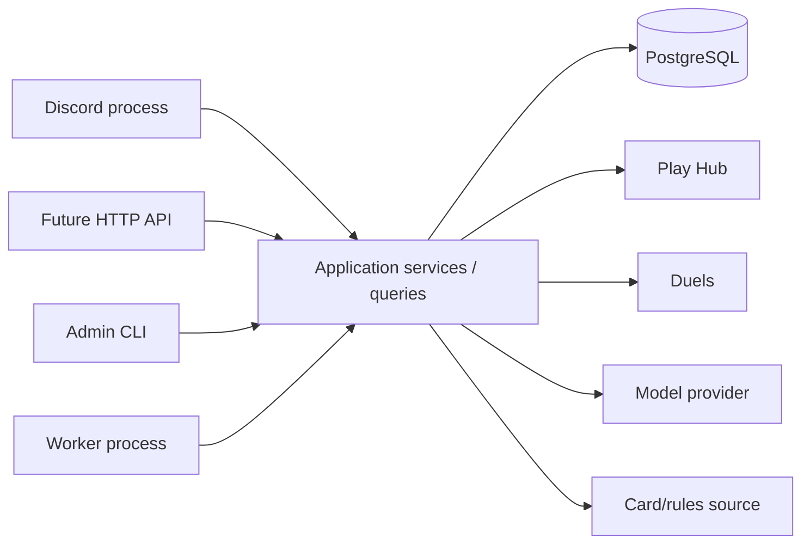
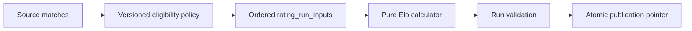
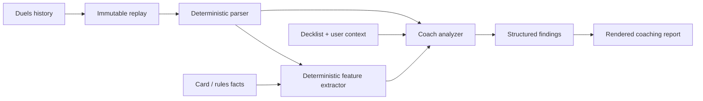

# Lorcana Platform — Ground-Up Reararchitecture

**Date:** 2026-09-13  
**Scope:** Global Play Hub corpus + Elo, Discord bot, Duels ingestion, replay coaching, future tournament tools  
**Architecture style:** Modular monolith, one PostgreSQL database, multiple thin runtime adapters

---

## 1. Executive decision

Do **not** continue evolving the current directory restructure as the architecture.
Treat it as a checkpoint containing useful behavior and tests.

Build one installable Python application around a small set of domain modules:

1. **Play Hub** — source ingestion and tournament data.
2. **Ratings** — deterministic rating policy, calculation, publication, and read models.
3. **Identity / Teams** — internal members and explicit links to Play Hub, Duels, and Discord identities.
4. **Duels** — account sync, replay storage, normalization, and replay provenance.
5. **Coach** — deterministic feature extraction plus model-assisted analysis and persisted reports.
6. **Catalog** — authoritative card/rules facts used by Coach.
7. **Jobs** — durable background work, retries, leases, and schedules.
8. **Interfaces** — Discord, CLI, and later HTTP API. Interfaces never own domain logic or SQL.

Use **PostgreSQL now as the target application database**. SQLite remains only as a frozen migration/audit source during cutover. Do not support SQLite and PostgreSQL indefinitely as two equal production backends.

Do **not** split this into microservices. The natural boundaries belong in code and database ownership first. Deploy the same package as separate processes where runtime concerns differ.

---

## 2. What is wrong with the current system

The current project has useful functionality, but the system boundaries do not match the product that is being built.

### Structural issues

- A large uncommitted restructure sits on top of `main`; the old root scripts are deleted while `src/`, tests, and docs are untracked.
- Active and legacy implementations coexist. `playhub/importer.py` and `legacy/import_event.py` are approximately 82% line-similar.
- The Discord scheduler still launches `lorcana.legacy.update_ratings`.
- Play Hub, ratings, teams, bot status, and utility modules open SQLite directly.
- The Discord command layer contains substantial query/statistics logic instead of being a thin adapter.
- Team membership is hard-coded in Python.
- Schema creation scripts are being used instead of real migrations.
- Operational state such as import success is mixed into source entity rows.
- Generic table names such as `players`, `matches`, and `events` become ambiguous once Duels and Coach exist.
- There is no durable Duels sync, replay ownership model, Coach persistence, or stable application API.

### Concrete correctness/deployment risks already visible

- `rating_history.result` is declared `REAL` while the code persists `WIN` / `LOSS` / `DRAW`. SQLite tolerates this; PostgreSQL will not.
- The bot DB-status query orders by `import_id`, while the schema uses `import_log_id`.
- The bot scheduler's in-process lock protects only one process and is not durable across restarts.
- The current Railway shim fails the repository's own outside-checkout packaging test unless the package is installed correctly.
- Rating eligibility is partly implicit in the importer instead of being a single versioned rating policy.
- The current source schema uses cascading deletes that should not be copied into immutable rating evidence.

### Testing gap

The tests currently protect the most valuable pure behavior—Elo arithmetic, a Play Hub parser regression, Duels replay normalization, settings, and snapshot auditing—but they do not yet protect the production Play Hub orchestration, bot queries, job/retry behavior, or Coach workflow.

---

## 3. Architectural rules

These are non-negotiable boundaries for the rewrite.

### Rule A — interfaces do not know SQL

Discord commands, HTTP handlers, and CLI commands may call application services or query services. They may not open database connections or contain SQL.

### Rule B — clients do not write the database

A Play Hub client fetches data. A Duels client fetches data. A model client calls a model. None of them persist application state.

### Rule C — repositories do not call networks

Repositories own SQL and transaction-local persistence. They do not fetch webpages, call Discord, or invoke an LLM.

### Rule D — services own workflows

Application services coordinate clients, pure parsers/calculators, and repositories. Services define transaction boundaries and idempotency behavior.

### Rule E — pure logic stays pure

Parsers, rating math, rating eligibility, replay feature extraction, and tournament calculations operate on typed values and do not import database, environment, Discord, or network code.

### Rule F — provider identities remain provider identities

A Play Hub `player_id`, Duels account/game ID, Discord user ID, and internal member ID are distinct identifiers. Never merge people by display name.

### Rule G — published Elo is immutable

A completed rating run is an immutable snapshot. Consumers resolve one published run and use that same run throughout a response.

### Rule H — Elo retention is bounded

Immutability does not mean indefinite retention. `global_elo` keeps exactly the currently published run and the immediately previous published run. Publishing rotates those two generations and prunes all older completed runs and their dependent input/history/current rows in the same transaction. Failed transient builds are pruned immediately. Scheduled refreshes compare the source digest first and do not create a duplicate run when eligible source facts are unchanged.

### Rule I — raw replay evidence is immutable

Never overwrite raw replay artifacts or normalized output in place. New parser/model versions create new derived records.

### Rule J — background work is durable

Scheduling does not live inside the Discord bot. Retryable work has a durable job record and idempotency key.

### Rule K — keep abstractions earned, not speculative

Use concrete repositories for PostgreSQL. Use Protocols/interfaces only for dependencies that genuinely vary: Play Hub client, Duels client, analyzer/model provider, clock in tests, and possibly artifact storage later.

---

## 4. Target source layout

Use a feature-first modular monolith. Every domain follows the same small vocabulary: records/types, pure logic, repository, service, and queries when needed.

```text
lorcana-platform/
  pyproject.toml
  alembic.ini
  migrations/
    env.py
    versions/

  src/lorcana/
    __init__.py
    config.py
    bootstrap.py
    errors.py

    db/
      engine.py
      tx.py
      metadata.py
      transfer_sqlite.py

    playhub/
      types.py
      client.py
      parser.py
      repository.py
      service.py
      queries.py

    ratings/
      types.py
      policy.py
      elo.py
      repository.py
      service.py
      queries.py

    identity/
      types.py
      repository.py
      service.py

    teams/
      types.py
      repository.py
      service.py
      queries.py

    duels/
      types.py
      client.py
      replay_parser.py
      features.py
      repository.py
      service.py

    catalog/
      types.py
      client.py
      repository.py
      service.py

    coach/
      types.py
      analyzer.py
      repository.py
      service.py
      queries.py

    tournament_tools/
      intentional_draws.py

    jobs/
      types.py
      repository.py
      service.py
      runner.py
      handlers.py

    interfaces/
      cli.py
      discord/
        bot.py
        commands/
          player.py
          leaderboard.py
          team.py
          set_champs.py
          coach.py
          intentional_draws.py
        presenters.py
      api/
        app.py
        auth.py
        routes/

  tests/
    unit/
      ratings/
      playhub/
      duels/
      coach/
      tournament_tools/
    integration/
      db/
      playhub/
      ratings/
      duels/
      jobs/
    contract/
      playhub/
      duels/
    fixtures/

  experiments/
  docs/
  data/                  # local ignored artifacts only
```

### Why this layout

This deliberately avoids a large generic `domain/application/infrastructure` hierarchy. The project is small enough that feature-first packages are easier to navigate. The boundary is enforced by file responsibility rather than by adding three folders around every class.

---

## 5. Runtime topology

Use one codebase and one PostgreSQL database, deployed as separate processes.



### Process 1 — `lorcana-bot`

Responsibilities:
- Connect to Discord.
- Parse slash command inputs.
- Call query/application services.
- Format and send responses.
- Enqueue long-running work such as Coach analysis.

It does **not**:
- run scheduled imports;
- rebuild ratings;
- contain SQL;
- scrape Play Hub;
- parse Duels replays inline.

### Process 2 — `lorcana-worker`

Responsibilities:
- Claim durable jobs from PostgreSQL.
- Import Play Hub events.
- Build/publish ratings.
- Sync Duels history/replays.
- Normalize replays.
- Run Coach feature extraction/analysis.
- Perform scheduled recurring jobs.

Start with one worker. Add concurrency only after work types and DB load are measured.

### Process 3 — `lorcana-api` (later)

Add when the Coach needs a client outside Discord/CLI, such as a ChatGPT integration or web UI. It calls the same services as Discord; it does not create a second implementation.

### PostgreSQL

One PostgreSQL instance is the authoritative runtime store.

### SQLite

SQLite is retained only for:
- frozen historical backups;
- migration validation;
- parity comparisons;
- local archival inspection.

No production feature should require a live SQLite database after cutover.

---

## 6. Database design

Use a single PostgreSQL schema initially with explicit table prefixes. This is clearer than generic names and simpler than multiple PostgreSQL schemas/search paths.

All new timestamps are `TIMESTAMPTZ`. Elo values are `DOUBLE PRECISION`. Boolean values are real `BOOLEAN`s. JSON payloads use `JSONB`. Internal IDs use UUIDs where the application owns identity; Play Hub source IDs remain their source numeric IDs.

### 6.1 Play Hub source domain

Rename the generic v2 source tables during PostgreSQL migration:

```text
playhub_stores
playhub_events
playhub_phases
playhub_rounds
playhub_players
playhub_registrations
playhub_matches
playhub_discovery_runs
playhub_import_attempts
playhub_event_sync_state
```

#### `playhub_events`

Contains source facts only: event identity, store, title, source statuses, format, start/end times, location, capacity, source URL, and latest source timestamps.

Do **not** put application workflow state such as `results_status`, last error, or retry counters on the event row.

#### `playhub_event_sync_state`

One row per event representing current ingestion state:

- `event_id`
- `state` (`discovered`, `pending`, `syncing`, `complete`, `partial`, `no_results`, `failed`)
- `last_attempt_at`
- `last_success_at`
- `last_error_category`
- `last_error_summary`
- `source_revision` or content hash where useful

#### `playhub_import_attempts`

Append-only history:

- attempt ID
- event ID
- started/completed timestamps
- worker/job ID
- status
- rounds expected/imported
- registrations/matches/players observed
- structured error category and sanitized detail

This replaces the overloaded `import_log` pattern and makes retries auditable.

#### Source constraints

After final corpus audit:
- unique registration `(event_id, player_id)`;
- FK consistency between match, round, phase, and event;
- source player IDs are stable primary keys;
- source rows are updated/upserted, not blindly deleted/reinserted.

Avoid cascade deletes from source event data into rating evidence. Source retirement should be explicit.

### 6.2 Identity and team domain

Keep the internal person model intentionally small.

```text
members
teams
team_memberships
member_playhub_links
discord_accounts
duels_connections
```

#### `members`

Internal application identity. UUID primary key and a preferred display name.

#### `member_playhub_links`

Explicitly maps a member to a `playhub_players.player_id`. This is how team/global Elo becomes associated with a known team member.

Do not infer this from names.

#### `discord_accounts`

Maps Discord user ID to member ID for authorization and personalization.

#### `duels_connections`

Represents a member-authorized Duels account/connection. Store provider identifiers and credential metadata. If provider credentials must be persisted, encrypt them with an application-held key; never log them.

#### `teams` / `team_memberships`

Move the current hard-coded Inkspire mapping into data. Membership has role/status and effective timestamps so future teams do not require code changes.

### 6.3 Ratings domain

Use immutable runs plus an explicit published pointer.

```text
rating_runs
rating_run_inputs
rating_history
rating_current
rating_publications
```

#### `rating_runs`

Key fields:
- run ID
- algorithm (`elo`)
- algorithm version
- policy version
- parameters JSON (`starting_rating`, `k_factor`, etc.)
- started/completed timestamps
- status (`building`, `validated`, `published`, `failed`)
- input count
- player count
- ordered input digest
- notes / aggregate exclusion counts

#### `rating_run_inputs`

This is critical for reproducibility.

One row per included match:
- `run_id`
- `sequence_number`
- `match_id`
- optional source ordering fields copied for audit

Primary key `(run_id, sequence_number)`; unique `(run_id, match_id)` where appropriate.

The input snapshot answers exactly which matches created a published Elo table, in what order.

#### `rating_history`

One row per player per included match, tied to a rating run. `result` is checked text/enum-like data (`WIN`, `LOSS`, `DRAW`), not `REAL`.

#### `rating_current`

One row per player per run containing final rating, record, peak, and matches played.

#### `rating_publications`

A small pointer table, e.g. publication name `global_elo`, stores both the current published run and the immediately previous published run. Publishing a replacement run atomically rotates `current -> previous`, points `current` at the new validated run, and prunes every older completed run. This deliberately bounds Elo storage to two published generations rather than preserving an unbounded run archive.

Consumers never determine “latest” with `MAX(rating_run_id)`; they resolve the publication pointer.

### 6.4 Duels/replay domain

```text
duels_games
duels_game_observations
duels_replays
duels_normalizations
duels_feature_sets
```

#### `duels_games`

Stable game-level metadata identified by provider game ID: queue, format, ranked flag, timestamps, match metadata.

#### `duels_game_observations`

A connection-scoped history observation. This allows the same game to be seen from multiple linked accounts/perspectives without pretending all provider history metadata is globally identical.

#### `duels_replays`

Immutable fetched artifact:
- application replay UUID
- provider game ID
- owning/observing connection
- perspective identifier where available
- fetched timestamp
- source hash
- compressed raw bytes (`BYTEA`) for initial scale
- status and validation metadata

If replay storage outgrows PostgreSQL later, move bytes behind an artifact repository without changing replay IDs.

#### `duels_normalizations`

Versioned parser output:
- replay ID
- parser implementation version (package/commit digest)
- normalized schema version
- normalized `JSONB`
- warnings/status
- created timestamp

Unique `(replay_id, parser_version)`.

The current parser's `schema_version=3` is not enough; parser implementation version must also be recorded.

#### `duels_feature_sets`

Versioned deterministic features derived from normalized replay:
- normalization ID
- feature-extractor version
- feature JSON
- created timestamp

Examples: mulligan choices, turn-two ramp access/play, quest/challenge sequence, resource curve, undo-effective actions, and other machine-computable facts.

Do not create a relational row for every frame/action until actual query patterns justify it.

### 6.5 Coach domain

```text
decklists
decklist_cards
coach_analysis_runs
coach_findings
coach_reports
```

#### `decklists` / `decklist_cards`

Versioned member deck snapshots. Coach analysis can reference the exact deck used for a game instead of whichever list happens to be current later.

#### `coach_analysis_runs`

Stores:
- member/requester
- normalization ID
- feature-set ID
- optional decklist version
- analyzer provider/model
- prompt/instruction version
- analysis configuration
- status
- token/cost metadata if available
- timestamps
- idempotency key

#### `coach_findings`

Structured findings, not just prose:
- category (`mulligan`, `sequencing`, `resource`, `combat`, `role`, etc.)
- severity/impact
- confidence
- observed fact vs inferred alternative
- cited replay action/turn references
- finding payload

This table lets Discord, an API, or a future trends view reuse the same analysis.

#### `coach_reports`

Rendered narrative/summary tied to an analysis run. Viewing a report does not re-call the model.

### 6.6 Catalog/rules domain

Coach accuracy requires a source of truth for card identity and facts.

```text
catalog_snapshots
catalog_cards
rules_snapshots
```

At minimum, the card catalog should support exact card name/version, set, ink/color, cost, classifications, rules text, and identifiers. The replay analyzer should resolve unfamiliar cards through this catalog instead of guessing from model memory.

Rules snapshots should be versioned when rules interpretation becomes part of deterministic checks.

### 6.7 Jobs domain

```text
jobs
job_attempts
scheduled_jobs
```

A job stores:
- job ID
- kind
- resource key
- payload JSONB
- idempotency key
- status
- attempt count
- available-at time
- lease owner/token/expiry
- progress
- created/updated/completed timestamps
- last error category/summary

Workers claim jobs atomically. State-changing completion checks the current lease token so a stale worker cannot commit after another worker takes over.

No Redis/Celery is needed initially.

---

## 7. Rating architecture

Ratings should become one of the cleanest parts of the project.

### Pure components

`ratings/elo.py`
- expected score
- updated score
- incremental Elo state
- no SQL
- no source filtering

`ratings/policy.py`
- takes a source match/event record
- returns a typed decision: included/excluded plus reason
- version string is explicit

Example initial policy:

```text
policy: global_elo_v1
include only:
  event format in {Core Constructed, Infinity Constructed}
  event ingestion state == complete
  match status == complete
  participant_count == 2
  no bye / ghost
  two distinct players
  valid winner or draw
  timestamp/order fields available
```

Whether PARTIAL events are accepted must be a deliberate policy version change, not hidden in a SQL query.

### Build flow



Detailed sequence:

1. Create `rating_run` in `building` state with policy/algorithm versions.
2. In a deterministic query, evaluate and order candidate matches.
3. Persist `rating_run_inputs` and their digest.
4. Calculate Elo only from that fixed snapshot.
5. Persist history/current results.
6. Validate counts, uniqueness, numerical sanity, and optionally compare against expected baseline.
7. Mark run validated.
8. In one transaction, update `rating_publications.global_elo` to the new run.
9. Retain the former current run as `previous` and prune every older completed run; only two published generations remain queryable.

A failed build never changes the live leaderboard.

---

## 8. Play Hub ingestion architecture

The current 1,400-line importer should not be moved intact into another folder. Split it by responsibility.

### `playhub/client.py`

Network only:
- event discovery pages
- event HTML/details
- round match pages
- standings pages
- timeouts
- HTTP status classification
- bounded retry/backoff for transient failures

It returns raw provider responses/JSON structures.

### `playhub/parser.py`

Pure parsing/normalization:
- hydration event extraction
- registration extraction
- phase/round normalization
- match normalization
- score/result interpretation
- source status normalization

Inputs are captured response strings/dicts; outputs are typed records.

### `playhub/repository.py`

SQL only:
- upsert source rows
- read candidate/sync state
- append import attempts
- update sync state

No HTTP and no parsing.

### `playhub/service.py`

Workflow:

1. Fetch outside a database transaction.
2. Parse/validate outside a transaction.
3. Open a short transaction and persist one consistent unit.
4. Commit progress/checkpoints deliberately.
5. Record an attempt and resulting state.

For large events, round-level persistence may be a sensible checkpoint. The service—not the parser or repository—defines that unit.

### Idempotency

Reimporting an event must be safe. Source IDs drive upserts. A crash after committing round 4 should allow round 4 to be repeated without duplicate rows.

---

## 9. Duels and Coach architecture

This is the most important new design because it determines whether the Coach becomes trustworthy or merely impressive-looking.

### Coaching is a pipeline, not one LLM prompt



### Stage 1 — Durable sync

`DuelsService.sync_connection(connection_id)`:
- fetch history pages;
- persist discovered game work before advancing checkpoints;
- deduplicate by provider IDs;
- download missing replay artifacts;
- record unavailable/transient failures for retry;
- never assume replay URLs or cursors live forever.

### Stage 2 — Normalize

Use the current tested replay parser as the starting implementation. Keep undo semantics explicit so analysis can distinguish effective play from actions later reverted.

Parser output should use stable action IDs/sequence numbers so findings can cite evidence.

### Stage 3 — Deterministic feature extraction

Before model analysis, calculate facts the program can know reliably:
- who was on play/draw;
- mulligan cards kept/shipped;
- turn boundaries;
- ink/resource sequence;
- cards played/quested/challenged;
- turn-two ramp access and execution;
- current visible board/hand context;
- undo-adjusted effective actions;
- outcome and clock information where available.

The extractor is versioned and tested against fixtures.

### Stage 4 — Catalog enrichment

Resolve card IDs/names against the card catalog. This is where ink color, card text, costs, and classifications come from. The Coach should never infer an unfamiliar card's color from a common archetype.

### Stage 5 — Analyzer

The model gets a compact evidence package, not raw network blobs:
- normalized action sequence / relevant state snapshots;
- deterministic features;
- exact card facts;
- decklist version;
- matchup/role context if supplied;
- coaching policy/instructions.

The output schema requires:
- finding type;
- observation;
- recommended alternative;
- evidence action IDs;
- confidence;
- whether the point is factual or inferential.

### Stage 6 — Persist and render

Persist analysis once. Discord/API render from stored findings/report. Do not pay for or vary analysis on every view.

### Team trends later

Do not build aggregate coaching dashboards first. Once individual reports are reliable, aggregate persisted deterministic features/findings by member and deck version. This supports metrics such as turn-two ramp execution without reparsing every replay during each request.

---

## 10. Discord architecture

The Discord bot becomes deliberately boring.

A command module should look conceptually like:

```python
async def player_command(interaction, query):
    result = await asyncio.to_thread(
        services.player_queries.search_and_get_profile,
        query,
    )
    await interaction.response.send_message(
        embed=present_player(result)
    )
```

The command knows Discord input/output. It does not know table names, SQL, rating formulas, or Play Hub URL formats.

### Application queries backing current commands

Current bot features map to reusable queries:

- `/player` -> `RatingQueries.player_profile(...)`
- `/leaderboard` -> `RatingQueries.leaderboard(...)`
- `/teamleaderboard` -> `TeamQueries.rating_dashboard(...)`
- `/setchamps` -> `PlayHubQueries.find_events(...)`
- `/dbstatus` -> `SystemQueries.ingestion_status(...)`

Future:
- `/coach` -> enqueue/lookup `CoachService` analysis
- `/drawcheck` -> `TournamentToolsService.intentional_draw_scenarios(...)`

### Scheduled posts

A durable scheduled job generates the report, then a delivery function sends it. The bot gateway should not be responsible for refreshing the entire database before posting.

---

## 11. Intentional-draw / tournament tools readiness

Tournament calculations belong in `tournament_tools/`, not in Discord.

For live draw-safety tools, add round-specific standings capture when implementation begins:

```text
playhub_standings_snapshots
playhub_standing_rows
```

A pure intentional-draw calculator takes a standings snapshot, remaining pairings/results assumptions, cut size, and tournament tiebreak rules. Discord becomes only one UI for it.

This prevents the next useful bot command from creating another direct-DB island.

---

## 12. Transactions and consistency

### Network calls never occur inside DB transactions

Fetch -> parse -> validate -> short persistence transaction.

### Repositories never commit

The service owns commit/rollback. This allows multiple repository writes to be atomic.

### Read responses resolve version pointers once

A player profile should resolve the published Elo run once and use it for rating, rank, best win, percentiles, and team comparisons. A publication changing halfway through a response must not produce mixed-version data.

### Immutable evidence

Rating inputs, raw replays, normalizations, feature sets, and Coach analysis runs are append-only/versioned evidence. Corrections create new versions/runs rather than silently mutating history.

---

## 13. Error model

Replace ad-hoc `print()`/catch-all behavior with small typed categories:

```text
ConfigurationError
ExternalServiceError
  AuthenticationError
  TransientExternalError
  PermanentExternalError
ParseError
ValidationError
NotFoundError
ConflictError
AuthorizationError
JobLeaseLostError
```

Persist safe error category + summary. Full stack traces go to structured logs, not user-facing Discord output or token-bearing database fields.

---

## 14. Configuration and secrets

One `Settings` object is created in `bootstrap.py` for each process.

Production requires:
- `DATABASE_URL`
- `DISCORD_BOT_TOKEN` for bot
- Duels application/provider secrets as needed
- analyzer/model credential for worker when Coach enabled
- encryption key if per-member provider credentials are persisted

There is no implicit SQLite fallback in production.

The process should fail fast when its required configuration is missing. Do not auto-create a local database because an env var was mistyped.

---

## 15. Observability

Every long operation gets a run/job ID and structured log context.

Minimum fields:
- process
- operation/job kind
- job/run/attempt ID
- event/game/member IDs where safe
- duration
- rows/items processed
- retry count
- success/error category

Add metrics only after logs and durable run records are reliable. Do not start with a full telemetry stack.

---

## 16. Dependency choices

Add only what is required for the architecture:

- `sqlalchemy` 2.x — Core, not ORM-heavy domain entities.
- `psycopg` 3 — PostgreSQL driver.
- `alembic` — schema migrations.
- existing `discord.py` — Discord adapter.
- existing sync HTTP client is acceptable initially; no async rewrite is required.
- FastAPI/Uvicorn only when the API is actually introduced.
- encryption library only when durable member credentials require it.

Do not add Redis, Celery, Kafka, a service mesh, GraphQL, or multiple databases.

---

## 17. Testing strategy

### Unit tests

Fast, no database/network:
- Play Hub parser fixtures.
- Elo math.
- Elo policy inclusion/exclusion reason for every edge case.
- Duels parser fixtures.
- replay feature extraction.
- intentional draw calculations.
- Coach analyzer output-schema validation with fake analyzer.

### Repository integration tests

Run against real PostgreSQL:
- migrations from empty database to head;
- transaction rollback;
- constraints;
- upsert/idempotency;
- rating publication pointer;
- job claiming/lease fencing;
- access/identity joins.

### Contract/recorded-response tests

For Play Hub and Duels clients/parsers:
- saved representative responses;
- empty standings;
- malformed hydration;
- pagination;
- 401/403;
- 429/5xx retry classification;
- changed replay revision;
- missing replay URL.

### End-to-end smoke tests

Against a temporary database using fake external clients:
- discover/import event -> rating build -> player query;
- Duels observation -> replay -> normalization -> features -> Coach report;
- Discord presenter consumes a query DTO without database access.

### Preserve current regression assets

Keep:
- current Duels raw/normalized fixture pairs;
- Play Hub reduced failing-event parser fixture;
- Elo parity snapshot/digest and exact legacy parity test;
- read-only snapshot audit.

---

## 18. Current code: keep, rewrite, or retire

### Keep and move with minimal behavior change

- `ratings/elo.py` pure calculator.
- `ratings/types.py` concept, renamed/refined as needed.
- Duels replay parser and fixtures.
- Play Hub hydration parser logic that fixed the `Invalid \\escape` failures.
- snapshot audit concepts.
- recorded Play Hub/Duels fixtures.
- verified Elo parity evidence.

### Rewrite behind the new boundaries

- `playhub/importer.py`
- `playhub/metadata.py`
- `playhub/results.py`
- rating SQL repository/service
- player/leaderboard/team query modules
- Discord command application
- scheduler
- team configuration
- database initialization

### Retire

- all runtime `legacy/` modules once replacement acceptance tests pass;
- root compatibility scripts after Railway commands use installed entry points;
- `db/bot_queries.py`;
- direct SQLite helper access from feature modules;
- schema `CREATE TABLE IF NOT EXISTS` initializers as production migration mechanism;
- in-bot scheduler.

### Keep only as experiments/reference

- Glicko experiments until a future explicit rating-system project.
- old inspection scripts that are still useful for forensic comparisons.

---

## 19. Migration plan

This rewrite should be done in vertical, testable slices. Do not rewrite all 14k lines and then attempt one cutover.

### Phase 0 — checkpoint the current work

Before new architecture work:

1. Remove local junk from consideration (`.venv`, `.DS_Store`, `.env`, generated egg-info).
2. Commit the current uncommitted restructure as an **archive/checkpoint**, not as the desired architecture.
3. Ensure the historical SQLite source/backup has a checksum and is never mutated during migration work.
4. Record the current known test result, including the packaging failure.

This prevents useful parser/tests from being lost while allowing aggressive deletion afterward.

### Phase 1 — packaging + PostgreSQL foundation

Implement:
- clean `pyproject.toml` entry points;
- settings/bootstrap;
- SQLAlchemy engine/transaction helper;
- Alembic;
- first PostgreSQL schema for Play Hub + ratings;
- integration-test database setup.

Acceptance gate:
- clean install outside repository;
- migrations to head from empty DB;
- all pure existing tests green;
- no runtime module creates tables.

### Phase 2 — SQLite -> PostgreSQL transfer

Build one explicit transfer utility from the audited SQLite schema into the renamed `playhub_*` tables.

Acceptance gate:
- exact source row-count parity by table;
- keyed field comparisons;
- preserved Play Hub IDs;
- timestamp/type validation;
- FK validation;
- final source checksum unchanged;
- safe rerun into a fresh target.

Do not dual-write production SQLite and PostgreSQL.

### Phase 3 — Play Hub importer rewrite

Port client/parsing behavior from the current v2 code into `client.py`, `parser.py`, repository, and service.

Acceptance gate:
- recorded fixtures reproduce current known parsing;
- direct event import works;
- empty/no-result events are handled;
- retry after partial persistence is idempotent;
- import attempt/sync-state records are correct;
- selected production events compare against SQLite source behavior.

### Phase 4 — ratings rewrite and publication

Port the verified pure Elo core and create explicit policy/snapshot/publication.

Acceptance gate:
- legacy parity policy reproduces the saved 477,438-match snapshot exactly;
- new production policy differences are reported intentionally;
- input digest is deterministic;
- a failed build cannot alter published ratings;
- player/leaderboard queries resolve a single published run.

### Phase 5 — Discord cutover

Rebuild current commands as thin adapters over query services.

Acceptance gate:
- `/player`, `/leaderboard`, `/teamleaderboard`, `/setchamps`, and status commands match expected behavior;
- no Discord module imports SQLAlchemy/database repositories directly;
- no scheduler/import subprocess runs from bot startup.

At this point the existing Elo/bot system is clean and production-ready on PostgreSQL.

### Phase 6 — identity/teams

Move static team mappings into `members`, `teams`, and provider links.

Acceptance gate:
- existing team leaderboard resolves the same Play Hub player IDs through membership data;
- Discord account association is explicit;
- duplicate names cannot merge accounts.

### Phase 7 — Duels durable pipeline

Add connections, history sync, raw replay persistence, normalization, and feature sets.

Acceptance gate:
- both existing replay fixtures normalize identically where the schema promises stability;
- duplicate sync is idempotent;
- changed replay revisions are versioned;
- failures remain retryable without losing raw data;
- perspective/account access is enforced.

### Phase 8 — Coach MVP

Build one flow:

`member selects one replay -> deterministic features -> analyzer -> persisted structured report -> Discord/API display`

Acceptance gate:
- report cites valid action/turn evidence;
- unfamiliar card attributes come from catalog, not guesses;
- undone actions are not treated as effective-line mistakes unless explicitly discussed;
- rerendering does not re-call the model;
- analysis version/model/prompt/deck context are recorded;
- private replay access is enforced.

### Phase 9 — API and advanced bot tools

Only now add:
- Coach HTTP API / ChatGPT integration;
- team trend reports;
- intentional-draw tool backed by standings snapshots;
- expanded live tournament tools.

---

## 20. Deployment sequence on Railway

Target services in one Railway project:

```text
PostgreSQL
lorcana-bot      -> command: lorcana-bot
lorcana-worker   -> command: lorcana-worker
lorcana-api      -> later, command: lorcana-api
```

Migrations run as a controlled deployment/release step, never automatically from bot/worker startup.

For cutover:

1. Finish/audit SQLite historical load.
2. Stop SQLite writers.
3. Take a final consistent backup/checksum.
4. Transfer to fresh PostgreSQL.
5. Run parity/integrity audits.
6. Build/publish ratings in PostgreSQL.
7. Deploy bot against PostgreSQL in read/query mode.
8. Enable worker Play Hub writes.
9. Keep the SQLite backup untouched for rollback/audit.

No dual-write period is needed.

---

## 21. The first implementation PR

The first implementation change should **not** touch the importer.

It should establish the skeleton that every later feature must obey:

1. clean installable package and entry points;
2. `Settings` + `bootstrap`;
3. PostgreSQL engine + transaction context;
4. Alembic baseline;
5. explicit `playhub_*` and `rating_*` table definitions;
6. preserved pure Elo and replay parser tests;
7. one PostgreSQL repository integration test;
8. no Discord or network behavior change yet.

That PR proves the foundation before large behavioral migrations begin.

---

## 22. Definition of “architecturally complete”

The rearchitecture is complete when all of the following are true:

- PostgreSQL is the sole live application database.
- Alembic is the only schema migration path.
- Play Hub network code, parsing, persistence, and orchestration are separate.
- Rating eligibility is one versioned policy.
- Every published rating run has an immutable ordered input snapshot and digest.
- Discord contains no SQL and no scheduled ingestion/rating pipeline.
- Team/member identity is stored in the database and provider links are explicit.
- Duels replay evidence is durable, versioned, and access-controlled.
- Coach analysis is derived from normalized evidence + deterministic features + verified card facts.
- Coach findings cite replay evidence and are persisted/versioned.
- Background work is durable and idempotent.
- Existing current commands work through shared services.
- The legacy runtime package is gone.
- A future API can expose the same services without rewriting business logic.

At that point Elo, Discord, and Coach are not three projects. They are three product surfaces over one coherent Lorcana platform.
